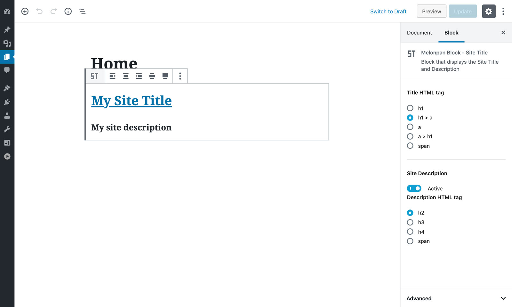

# Melonpan Block - Site Title

[Demo](https://gutenberg-showcase.melonpan.io/melonpan-block-site-title) - [Documentation](https://melonpan.io/gutenberg-blocks/melonpan-block-site-title) - [WordPress](https://wordpress.org/plugins/melonpan-block-site-title)

 

Block that displays the Site Title and Description. No stylesheets or scripts are added in the front-end.

 

## Features

The block comes with the following settings:

- **Title HTML tag**: Choose between _h1_, _h1 > a_, _a_, _a > h1_, _span_
- **Description enabled**: Display the site description
- **Description HTML tag**: Choose between _h2_, _h3_, _h4_, _span_

 

## Screenshots

